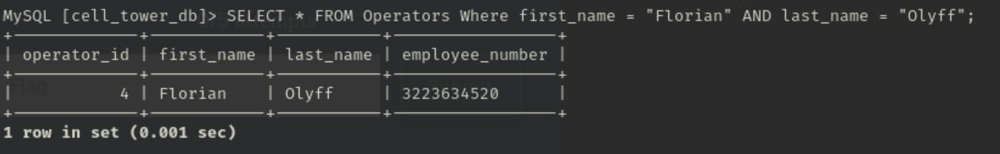

Florian Olyff operates several towers. What is the most commonly used 
antenna type (name) on the towers she manages?

Submit the flag as flag{antenna_name number}. Example: flag{Long Antenna 5}.

__________________________________________________________________________________

WOW A SQL CHALLENGE! I was told you dont normally see these during CTF's! Im super excited 
to try and tackle some of these!

Firstly I went around the database and seeing the tables and the layouts using basic SQL querys like SELECT * FROM "table name"
and as well as SCHEMA.

I found a table that listed Operators and thier information.
The very first SQL Query was: SELECT * FROM Operators where first_name = "Florian" AND last_name = "Olyff";

From this SQL Query we find that Florian Olyffs Operator ID is "4"

Within the towers table I was able to see that the Operator ID was linked to this table.
Using the Query:  SELECT DISTINCT tower_id FROM Towers WHERE operator_id = "4"

The reason why I used DISTINCT within my query is so that I could minimize the amount of responses the Query would repeat back to me. (DISTINCT will only spit back one occurence of the tower_id so say theres 11 entries of operator_id 4 at tower_id 189 it will only spit it back at me once instead of 11 times.)

From here I decided to proced to the Tower_Sectors table where I know tower_id could be used. Using the Query: SELECT * FROM Tower_Sectors WHERE tower_id = "189"

using this query I was able to get all the instances of tower id 189 and all the antenna ids. We count up the antenna id with the most instances and it was antenna number 9.

The flag requires the fulL name of the antenna so using SELECT * FROM Antennas;

We get the full name of the antenna and add the amount of times it occured and we have the flag!

Note: I do reccomend for easy navigation of the databases when you are first looking through the tables and the schemas take a screen shot of them
to refrence back to  so you can see what elements are linked to each other from other tables.

